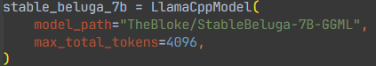

**Python 3.8 / 3.9 / 3.10 / 3.11** on **Windows / Linux / MacOS**

[](https://github.com/c0sogi/llama-api/actions/workflows/ci.yml)

---
## About this repository
This project aims to provide a simple way to run **LLama.cpp** and **Exllama** models as a OpenAI-like API server.

You can use this server to run the models in your own application, or use it as a standalone API server!

## Before you start

1. **Python 3.8 / 3.9 / 3.10 / 3.11** is required to run the server. You can download it from https://www.python.org/downloads/

2. **llama.cpp**: To use cuBLAS(for nvidia gpus) version of llama.cpp, and if you are **Windows** user, download [CUDA Toolkit 11.8](https://developer.nvidia.com/cuda-11-8-0-download-archive).

3. **ExLlama**: To use ExLlama, install the prerequisites of this [repository](https://github.com/turboderp/exllama). Maybe **Windows** user needs to install both [MSVC 2022](https://visualstudio.microsoft.com/downloads/) and [CUDA Toolkit 11.8](https://developer.nvidia.com/cuda-11-8-0-download-archive).


## How to run server

All required packages will be installed automatically with this command.

```bash
python -m main --install-pkgs
```

If you already have all required packages installed, you can skip the installation with this command.
```bash
python -m main
```
Options:
```b
usage: main.py [-h] [--port PORT] [--max-workers MAX_WORKERS]
               [--max-semaphores MAX_SEMAPHORES]
               [--max-tokens-limit MAX_TOKENS_LIMIT] [--api-key API_KEY]
               [--no-embed] [--tunnel] [--install-pkgs] [--force-cuda]
               [--skip-torch-install] [--skip-tf-install] [--skip-compile]
               [--no-cache-dir] [--upgrade]

options:
  -h, --help            show this help message and exit
  --port PORT, -p PORT  Port to run the server on; default is 8000
  --max-workers MAX_WORKERS, -w MAX_WORKERS
                        Maximum number of process workers to run; default is 1
  --max-semaphores MAX_SEMAPHORES, -s MAX_SEMAPHORES
                        Maximum number of process semaphores to permit;
                        default is 1
  --max-tokens-limit MAX_TOKENS_LIMIT, -l MAX_TOKENS_LIMIT
                        Set the maximum number of tokens to `max_tokens`. This
                        is needed to limit the number of tokens
                        generated.Default is None, which means no limit.        
  --api-key API_KEY, -k API_KEY
                        API key to use for the server
  --no-embed            Disable embeddings endpoint
  --tunnel, -t          Tunnel the server through cloudflared
  --install-pkgs, -i    Install all required packages before running the        
                        server
  --force-cuda, -c      Force CUDA version of pytorch to be used when
                        installing pytorch. e.g. torch==2.0.1+cu118
  --skip-torch-install, --no-torch
                        Skip installing pytorch, if `install-pkgs` is set       
  --skip-tf-install, --no-tf
                        Skip installing tensorflow, if `install-pkgs` is set    
  --skip-compile, --no-compile
                        Skip compiling the shared library of LLaMA C++ code     
  --no-cache-dir, --no-cache
                        Disable caching of pip installs, if `install-pkgs` is   
                        set
  --upgrade, -u         Upgrade all packages and repositories before running    
                        the server
```

### Unique features

1. **On-Demand Model Loading**
   - The project tries to load the model defined in `model_definitions.py` into the worker process when it is sent along with the request JSON body. The worker continually uses the cached model and when a request for a different model comes in, it unloads the existing model and loads the new one. 

2. **Parallelism and Concurrency Enabled**
   - Due to the internal operation of the process pool, both parallelism and concurrency are secured. The `--max-workers $NUM_WORKERS` option needs to be provided when starting the server. This, however, only applies when requests are made simultaneously for different models. If requests are made for the same model, they will wait until a slot becomes available due to the semaphore.

3. **Auto Dependency Installation**
   - The project automatically do git clones and installs the required dependencies, including **pytorch** and **tensorflow**, when the server is started. This is done by checking the `pyproject.toml` or `requirements.txt` file in the root directory of this project or other repositories. `pyproject.toml` will be parsed into `requirements.txt` with `poetry`. If you want to add more dependencies, simply add them to the file.


## How can I get the models?

   #### 1. **Automatic download** (_Recommended_)
   > 

   - Just set **model_path** of your own model defintion in `model_definitions.py` as actual **huggingface repository** and run the server. The server will automatically download the model from HuggingFace.co, when the model is requested for the first time.
   
   #### 2. **Manual download**
   > 

   - You can download the models manually if you want. I prefer to use the [following link](https://huggingface.co/TheBloke) to download the models


1. For **LLama.cpp** models: Download the **gguf** file from the GGML model page. Choose quantization method you prefer. The gguf file name will be the **model_path**.

   The LLama.cpp model must be put here as a **gguf** file, in `models/ggml/`.

   For example, if you downloaded a q4_k_m quantized model from [this link](https://huggingface.co/TheBloke/MythoMax-L2-Kimiko-v2-13B-GGUF),
   The path of the model has to be **mythomax-l2-kimiko-v2-13b.Q4_K_M.gguf**.

     *Available quantizations: q4_0, q4_1, q5_0, q5_1, q8_0, q2_K, q3_K_S, q3_K_M, q3_K_L, q4_K_S, q4_K_M, q5_K_S, q6_K*

2. For **Exllama** models: Download three files from the GPTQ model page: **config.json / tokenizer.model / \*.safetensors** and put them in a folder. The folder name will be the **model_path**.

   The Exllama GPTQ model must be put here as a **folder**, in `models/gptq/`.

   For example, if you downloaded 3 files from [this link](https://huggingface.co/TheBloke/orca_mini_7B-GPTQ/tree/main),

   - orca-mini-7b-GPTQ-4bit-128g.no-act.order.safetensors
   - tokenizer.model
   - config.json

   then you need to put them in a folder.
   The path of the model has to be the folder name. Let's say, **orca_mini_7b**, which contains the 3 files.


## Where to define the models
Define llama.cpp & exllama models in `model_definitions.py`. You can define all necessary parameters to load the models there. Refer to the example in the file.
or, you can define the models in python script file that includes `model` and `def` in the file name. e.g. `my_model_def.py`.
The file must include at least one llm model (LlamaCppModel or ExLlamaModel) definition.
Also, you can define `openai_replacement_models` dictionary in the file to replace the openai models with your own models. For example, 

```python
# my_model_def.py
from llama_api.schemas.models import LlamaCppModel, ExLlamaModel

# `my_ggml` and `my_ggml2` is the same definition of same model.
my_ggml = LlamaCppModel(model_path="TheBloke/MythoMax-L2-Kimiko-v2-13B-GGUF", max_total_tokens=4096)
my_ggml2 = LlamaCppModel(model_path="models/ggml/mythomax-l2-kimiko-v2-13b.Q4_K_M.gguf", max_total_tokens=4096)

# `my_gptq` and `my_gptq2` is the same definition of same model.
my_gptq = ExLlamaModel(model_path="TheBloke/orca_mini_7B-GPTQ", max_total_tokens=8192)
my_gptq2 = ExLlamaModel(model_path="models/gptq/orca_mini_7b", max_total_tokens=8192)

# You can replace the openai models with your own models.
openai_replacement_models = {"gpt-3.5-turbo": "my_ggml", "gpt-4": "my_gptq2"}

```
The RoPE frequency and scaling factor will be automatically calculated and set if you don't set them in the model definition. Assuming that you are using Llama2 model.

Certainly, you can use the following Markdown template for your GitHub README to explain how to use Langchain with custom models. This guide will include information on defining the `my_model_def.py` and using it in `langchain_test.py`.

## Usage: Langchain integration

Langchain allows you to incorporate custom language models seamlessly. This guide will walk you through setting up your own custom model, replacing OpenAI models, and running text or chat completions.

1. Defining Your Custom Model

First, you need to define your custom language model in a Python file, for instance, `my_model_def.py`. This file should include the definition of your custom model.

```python
# my_model_def.py
from llama_api.schemas.models import LlamaCppModel, ExllamaModel

mythomax_l2_13b_gptq = ExllamaModel(
    model_path="TheBloke/MythoMax-L2-13B-GPTQ",  # automatic download
    max_total_tokens=4096,
)
```

In the example above, we've defined a custom model named `mythomax_l2_13b_gptq` using the `ExllamaModel` class.

2. Replacing OpenAI Models

You can replace an OpenAI model with your custom model using the `openai_replacement_models` dictionary. Add your custom model to this dictionary in the `my_model_def.py` file.

```python
# my_model_def.py (Continued)
openai_replacement_models = {"gpt-3.5-turbo": "mythomax_l2_13b_gptq"}
```

Here, we replaced the `gpt-3.5-turbo` model with our custom `mythomax_l2_13b_gptq` model.

3. Running Text/Chat Completions

Finally, you can utilize your custom model in Langchain for performing text and chat completions.

```python
# langchain_test.py
from langchain.chat_models import ChatOpenAI
from os import environ

environ["OPENAI_API_KEY"] = "Bearer foo"

chat_model = ChatOpenAI(
    model="gpt-3.5-turbo",
    openai_api_base="http://localhost:8000/v1",
)
print(chat_model.predict("hi!"))
```

Now, running the `langchain_test.py` file will make use of your custom model for completions.

That's it! You've successfully integrated a custom model into Langchain. Enjoy your enhanced text and chat completions!

## Usage: Text Completion
Now, you can send a request to the server.

```python
import requests

url = "http://localhost:8000/v1/completions"
payload = {
    "model": "my_ggml",
    "prompt": "Hello, my name is",
    "max_tokens": 30,
    "top_p": 0.9,
    "temperature": 0.9,
    "stop": ["\n"]
}
response = requests.post(url, json=payload)
print(response.json())

# Output:
# {'id': 'cmpl-243b22e4-6215-4833-8960-c1b12b49aa60', 'object': 'text_completion', 'created': 1689857470, 'model': 'D:/llama-api/models/ggml/mythomax-l2-kimiko-v2-13b.Q4_K_M.gguf', 'choices': [{'text': " John and I'm excited to share with you how I built a 6-figure online business from scratch! In this video series, I will", 'index': 0, 'logprobs': None, 'finish_reason': 'length'}], 'usage': {'prompt_tokens': 6, 'completion_tokens': 30, 'total_tokens': 36}}
```

## Usage: Chat Completion

```python
import requests

url = "http://localhost:8000/v1/chat/completions"
payload = {
    "model": "gpt-4",
    "messages": [{"role": "user", "content": "Hello there!"}],
    "max_tokens": 30,
    "top_p": 0.9,
    "temperature": 0.9,
    "stop": ["\n"]
}
response = requests.post(url, json=payload)
print(response.json())

# Output:
# {'id': 'chatcmpl-da87a0b1-0f20-4e10-b731-ba483e13b450', 'object': 'chat.completion', 'created': 1689868843, 'model': 'D:/llama-api/models/gptq/orca_mini_7b', 'choices': [{'index': 0, 'message': {'role': 'assistant', 'content': " Hi there! Sure, I'd be happy to help you with that. What can I assist you with?"}, 'finish_reason': 'stop'}], 'usage': {'prompt_tokens': 11, 'completion_tokens': 23, 'total_tokens': 34}}
```


## Usage: Vector Embedding

You can also use the server to get embeddings of a text.
For sentence encoder(e.g. universal-sentence-encoder/4), **TensorFlow Hub** is used. For the other models, embedding model will automatically be downloaded from **HuggingFace**, and inference will be done using **Transformers** and **Pytorch**.
```python
import requests

url = "http://localhost:8000/v1/embeddings"
payload = {
  "model": "intfloat/e5-large-v2",  # You can also use `universal-sentence-encoder/4`
  "input": "hello world!"
}
response = requests.post(url, json=payload)
print(response.json())

# Output:
# {'object': 'list', 'model': 'intfloat/e5-large-v2', 'data': [{'index': 0, 'object': 'embedding', 'embedding': [0.28619545698165894, -0.8573919534683228, ...,  1.0349756479263306]}], 'usage': {'prompt_tokens': -1, 'total_tokens': -1}}
```
