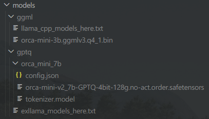

**Python 3.8 / 3.9 / 3.10 / 3.11** on **Windows / Linux / MacOS**

[](https://github.com/c0sogi/llama-api/actions/workflows/ci.yml)

---
## About this repository
This project aims to provide a simple way to run **LLama.cpp** and **Exllama** models as a OpenAI-like API server.

You can use this server to run the models in your own application, or use it as a standalone API server!


### Unique features

1. **On-Demand Model Loading**
   > **Caution:** There is a bug where VRAM does not get freed when unloading, if **cuBLAS** is used in **llama.cpp**. This issue has been reported for a while but it's still unresolved.
   - The project tries to load the model defined in `model_definitions.py` into the worker process when it is sent along with the request JSON body. The worker continually uses the cached model and when a request for a different model comes in, it unloads the existing model and loads the new one. 

2. **Parallelism and Concurrency Enabled**
   - Due to the internal operation of the process pool, both parallelism and concurrency are secured. The `--max-workers $NUM_WORKERS` option needs to be provided when starting the server. This, however, only applies when requests are made simultaneously for different models. If requests are made for the same model, they will wait until a slot becomes available due to the semaphore.

3. **Auto Dependency Installation**
   - The project automatically do git clones and installs the required dependencies, including **pytorch** and **tensorflow**, when the server is started. This is done by checking the `pyproject.toml` or `requirements.txt` file in the root directory of this project or other repositories. `pyproject.toml` will be parsed into `requirements.txt` with `poetry`. If you want to add more dependencies, simply add them to the file.

## Before you start

1. **Python 3.8 / 3.9 / 3.10 / 3.11** is required to run the server. You can download it from https://www.python.org/downloads/

2. **llama.cpp**: To use llama.cpp, and if you are **Windows** user, download [CMake](https://cmake.org/download/) to compile library.

3. **ExLlama**: To use ExLlama, install the prerequisites of this [repository](https://github.com/turboderp/exllama). Maybe **Windows** user needs to install both [MSVC 2022](https://visualstudio.microsoft.com/downloads/) and [CUDA Toolkit 11.8](https://developer.nvidia.com/cuda-11-8-0-download-archive).

## How to download the models

You can download the models from HuggingFace. I prefer to use the following link to download the models: https://huggingface.co/TheBloke

1. **LLama.cpp** models: Download the **bin** file from the GGML model page. Choose quantization method you prefer. The bin file name will be the **model_path**.

     *Available quantizations: q4_0, q4_1, q5_0, q5_1, q8_0, q2_K, q3_K_S, q3_K_M, q3_K_L, q4_K_S, q4_K_M, q5_K_S, q6_K*

2. **Exllama** models: Download three files from the GPTQ model page: **config.json / tokenizer.model / xxx.safetensors** and put them in a folder. The folder name will be the **model_path**.

## Where to put the models

> **Note:** The models are not included in this repository. You have to download them from HuggingFace.


### 1. Llama.cpp
The LLama.cpp GGML model must be put here as a **bin** file, in `models/ggml/`.

For example, if you downloaded a q4_0 quantized model from "https://huggingface.co/TheBloke/robin-7B-v2-GGML",
The path of the model has to be **robin-7b.ggmlv3.q4_0.bin**.

### 2. Exllama
The Exllama GPTQ model must be put here as a **folder**, in `models/gptq/`.

For example, if you downloaded 3 files from "https://huggingface.co/TheBloke/orca_mini_7B-GPTQ/tree/main":

- orca-mini-7b-GPTQ-4bit-128g.no-act.order.safetensors
- tokenizer.model
- config.json

Then you need to put them in a folder.
The path of the model has to be the folder name. Let's say, **orca_mini_7b**, which contains the 3 files.



## Where to define the models
Define llama.cpp & exllama models in `model_definitions.py`. You can define all necessary parameters to load the models there. Refer to the example in the file.

## How to run server

All required packages will be installed automatically with this command.

```bash
python -m main --install-pkgs
```

If you already have all required packages installed, you can skip the installation with this command.
```bash
python -m main
```
Options:
```b
  -h, --help            show this help message and exit
  -p PORT, --port PORT  Port to run the server on; default is 8000
  -w MAX_WORKERS, --max-workers MAX_WORKERS
                        Maximum number of process workers to run; default is 1
  --install-pkgs        Install all required packages before running the server
  --force-cuda          Force CUDA version of pytorch to be usedwhen installing pytorch. e.g. torch==2.0.1+cu118
  --skip-torch-install  Skip installing pytorch, if `install-pkgs` is set
  --skip-tf-install     Skip installing tensorflow, if `install-pkgs` is set
  -k API_KEY, --api-key API_KEY
                        API key to use for the server
```

## Usage: Text Completion
Now, you can send a request to the server.

```python
import requests

url = "http://localhost:8000/v1/completions"
payload = {
    "model": "orca_mini_3b",
    "prompt": "Hello, my name is",
    "max_tokens": 30,
    "top_p": 0.9,
    "temperature": 0.9,
    "stop": ["\n"]
}
response = requests.post(url, json=payload)
print(response.json())

# Output:
# {'id': 'cmpl-243b22e4-6215-4833-8960-c1b12b49aa60', 'object': 'text_completion', 'created': 1689857470, 'model': 'D:/llmchat-llama-extension/models/ggml/orca-mini-3b.ggmlv3.q4_1.bin', 'choices': [{'text': " John and I'm excited to share with you how I built a 6-figure online business from scratch! In this video series, I will", 'index': 0, 'logprobs': None, 'finish_reason': 'length'}], 'usage': {'prompt_tokens': 6, 'completion_tokens': 30, 'total_tokens': 36}}
```

## Usage: Chat Completion

```python
import requests

url = "http://localhost:8000/v1/chat/completions"
payload = {
    "model": "orca_mini_3b",
    "messages": [{"role": "user", "content": "Hello there!"}],
    "max_tokens": 30,
    "top_p": 0.9,
    "temperature": 0.9,
    "stop": ["\n"]
}
response = requests.post(url, json=payload)
print(response.json())

# Output:
# {'id': 'chatcmpl-da87a0b1-0f20-4e10-b731-ba483e13b450', 'object': 'chat.completion', 'created': 1689868843, 'model': 'D:/llmchat-llama-extension/models/ggml/orca-mini-3b.ggmlv3.q4_1.bin', 'choices': [{'index': 0, 'message': {'role': 'assistant', 'content': " Hi there! Sure, I'd be happy to help you with that. What can I assist you with?"}, 'finish_reason': 'stop'}], 'usage': {'prompt_tokens': 11, 'completion_tokens': 23, 'total_tokens': 34}}
```


## Usage: Vector Embedding

You can also use the server to get embeddings of a text.
For sentence encoder(e.g. universal-sentence-encoder/4), **TensorFlow Hub** is used. For the other models, embedding model will automatically be downloaded from **HuggingFace**, and inference will be done using **Transformers** and **Pytorch**.
```python
import requests

url = "http://localhost:8000/v1/embeddings"
payload = {
  "model": "intfloat/e5-large-v2",  # You can also use `universal-sentence-encoder/4`
  "input": "hello world!"
}
response = requests.post(url, json=payload)
print(response.json())

# Output:
# {'object': 'list', 'model': 'intfloat/e5-large-v2', 'data': [{'index': 0, 'object': 'embedding', 'embedding': [0.28619545698165894, -0.8573919534683228, ...,  1.0349756479263306]}], 'usage': {'prompt_tokens': -1, 'total_tokens': -1}}
```